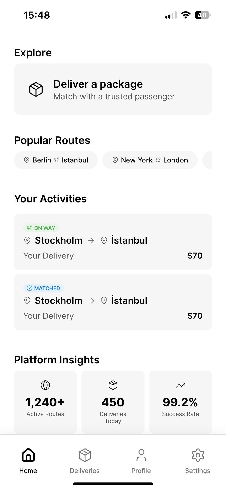
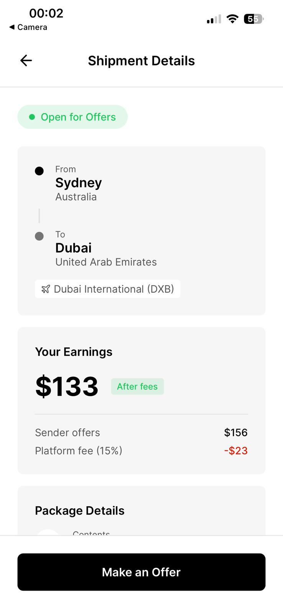
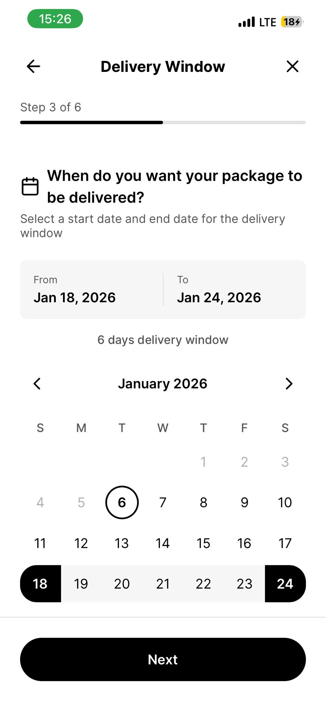
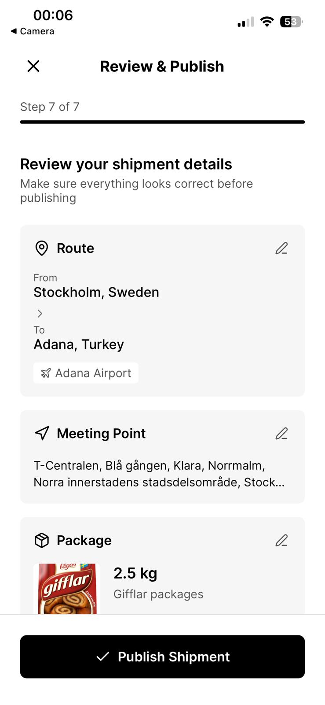
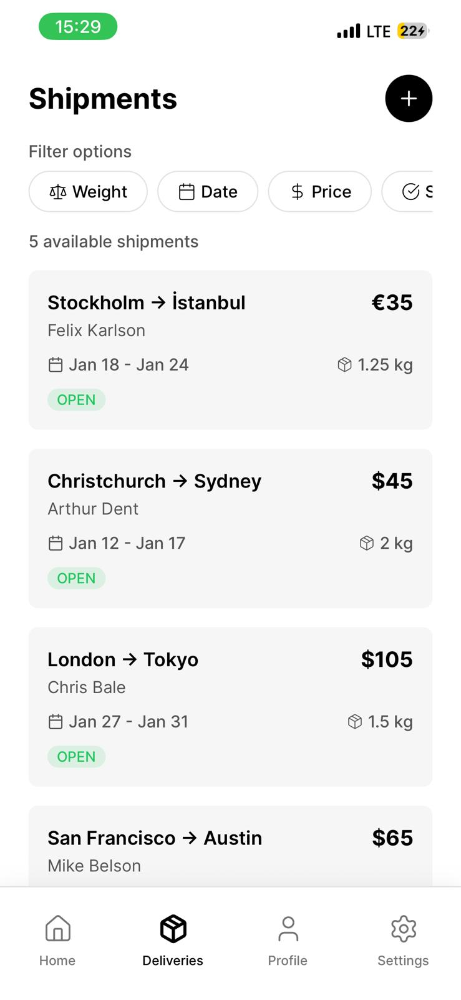
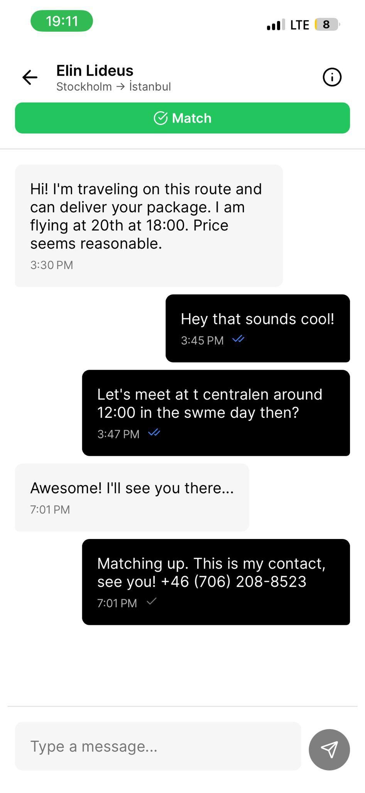
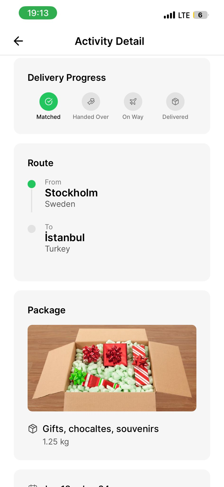

# Raven v2: Decentralized P2P Logistics Protocol

[](https://www.typescriptlang.org/)
[](https://nestjs.com/)
[](https://expo.dev/)
[](https://www.prisma.io/)

**Raven** is a peer-to-peer (P2P) international logistics protocol designed to solve the "Parcel Gap." By connecting travelers with unused luggage capacity to senders in need of affordable, high-speed shipping, Raven transforms global flight infrastructure into a decentralized delivery network.

---

## 🚀 The Vision

Traditional logistics (DHL, FedEx) rely on expensive, rigid hub-and-spoke models that impose a "tax" on progress through high costs and artificial latency. Raven moves from a **Social Graph** to a **Utility Graph**, monetizing the "Dead Capital" of airline luggage allowances.

- **For Senders (Scribes):** Ship small, urgent items (medicine, documents, home comforts) at a fraction of the cost of commercial carriers.
- **For Travelers (Ravens):** Subsidize travel costs by monetizing empty suitcase space.

---

## 📱 Mobile Application Preview

The Raven interface utilizes a monochromatic, high-contrast design system to minimize cognitive load and maximize utility during high-stress logistics tasks.

### **Core Application Flow**

<table style="width: 100%; border-collapse: collapse;">
  <tr>
    <td align="center" width="33%">
      <b>1. Discovery & Insights</b><br>
      <br>
      <i>Main dashboard featuring route discovery and platform metrics.</i>
    </td>
    <td align="center" width="33%">
      <b>2. Shipment Details</b><br>
      <br>
      <i>Transparent fee breakdown and route geocoding.</i>
    </td>
    <td align="center" width="33%">
      <b>3. Multi-Step Creation</b><br>
      <br>
      <i>Iterative wizard for defining time-sensitive delivery windows.</i>
    </td>
  </tr>
  <tr>
    <td align="center" width="33%">
      <b>4. Review & Verification</b><br>
      <br>
      <i>Final metadata validation before publishing to the network.</i>
    </td>
    <td align="center" width="33%">
      <b>5. Global Marketplace</b><br>
      <br>
      <i>Filtered feed of real-time P2P logistics opportunities.</i>
    </td>
    <td align="center" width="33%">
      <b>6. Real-Time Negotiation</b><br>
      <br>
      <i>In-app secure messaging with read receipts and match confirmation.</i>
    </td>
  </tr>
</table>

### **Shipment Lifecycle Tracking**

The **Atomic Handshake** is visualized through a granular progress tracker, providing "Scribes" and "Ravens" with a single source of truth for package custody.

<p align="center">
  
</p>

---

## 🛠️ Technical Stack

- **Mobile Client:** React Native (Expo) with a monochromatic, high-contrast design system inspired by Uber's Base Design.
- **Backend:** NestJS providing a modular, type-safe RESTful API.
- **Database:** PostgreSQL with **Prisma ORM** for strict relational integrity and ACID compliance.
- **Authentication:** Firebase Admin SDK for server-side cryptographic identity verification.
- **State Management:** Zustand for lightweight, efficient global state.

---

## 🛡️ Key Engineering Features

### **The Atomic Handshake Protocol**

A custom-built state machine that ensures secure custody transfer without a central authority. Using Prisma interactive transactions, the protocol atomically locks capacity and manages escrow funds only when both parties digitally sign the physical handover.

### **Zero-Trust Security**

By integrating server-side verification of Firebase tokens, the system ensures that user identity is verified against real-world government documents (passports/IDs) before any transaction is initiated.

### **Real-Time Synchronization**

Optimized for low-latency interactions, the system ensures sub-200ms updates for matching, messaging, and status transitions across cross-platform devices.

---

## 📂 Repository Structure

```bash
├── .agent           # Latest snapshots and system documentation
├── client           # Expo/React Native mobile codebase
│   ├── components   # Reusable UI modules (8px grid based)
│   └── screens      # Smart containers for application logic
├── server           # NestJS backend modules
│   ├── src          # Auth, Shipment, and Travel controllers
│   └── prisma       # Database schema and migrations
└── validate-system.js # System-wide platform debugging scripts
```

---

## ✅ Current Development Status

> Last updated: March 2026

| Module | Status | Notes |
|--------|--------|-------|
| Authentication (Firebase) | ✅ Complete | Sign up / login / token verification |
| User Profile | ✅ Complete | Profile view, public profile, password update |
| Shipment Creation (6-step wizard) | ✅ Complete | Full flow + review screen |
| Shipment Marketplace | ✅ Complete | Filtered feed with real-time data |
| Offer & Matching System | ✅ Complete | Atomic handshake protocol |
| In-App Messaging | ✅ Complete | Read receipts, match confirmation |
| Activity & Lifecycle Tracking | ✅ Complete | Granular status machine |
| Earnings Dashboard | ✅ Complete | Courier payout overview |
| Payments Infrastructure | 🔄 In Progress | Stripe integration, escrow logic |
| Push Notifications | 🔄 In Progress | Firebase Cloud Messaging |
| Production Deployment | 🔜 Planned | EAS Build + cloud server provisioning |

---

## 🚀 Getting Started

### Prerequisites

- Node.js 18+
- Expo CLI (`npm install -g expo-cli`)
- PostgreSQL database
- Firebase project credentials

### Client (Mobile)

```bash
cd client
npm install
npx expo start
```

### Server (Backend)

```bash
cd server
npm install
npx prisma migrate dev
npm run start:dev
```

---

## 🗺️ Roadmap

- [ ] Stripe payment integration & escrow release
- [ ] Push notification delivery for match/message events
- [ ] ID verification via government document upload
- [ ] In-app rating & trust score system
- [ ] EAS production build (iOS + Android)
- [ ] Admin dashboard for dispute resolution
