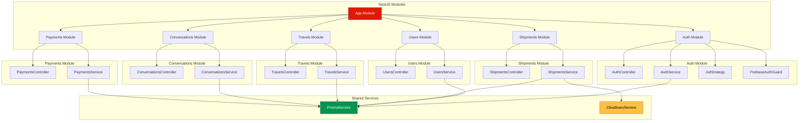
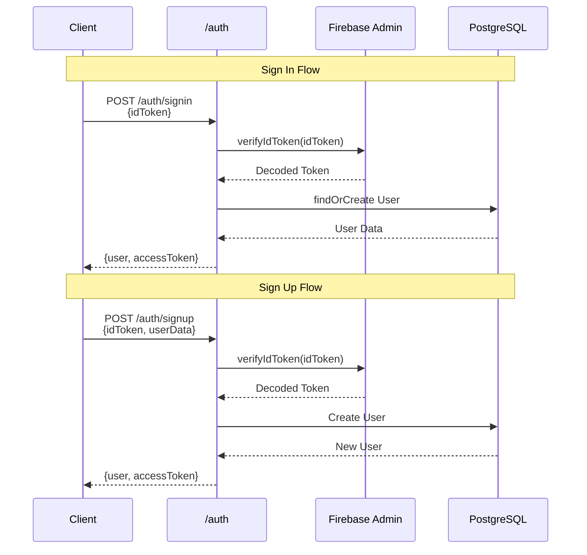
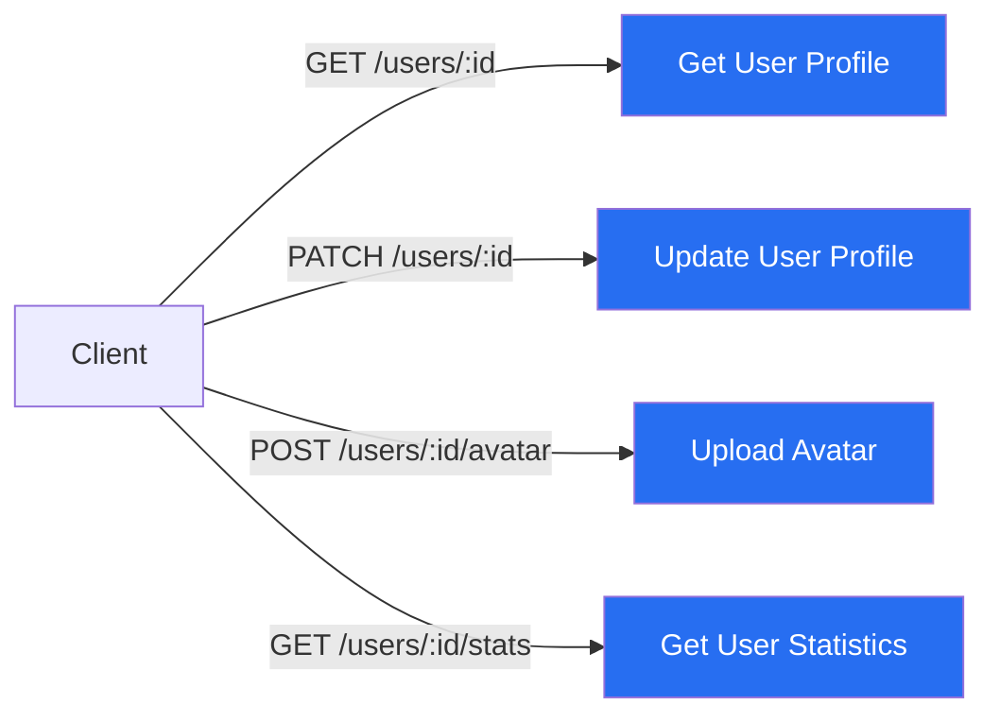
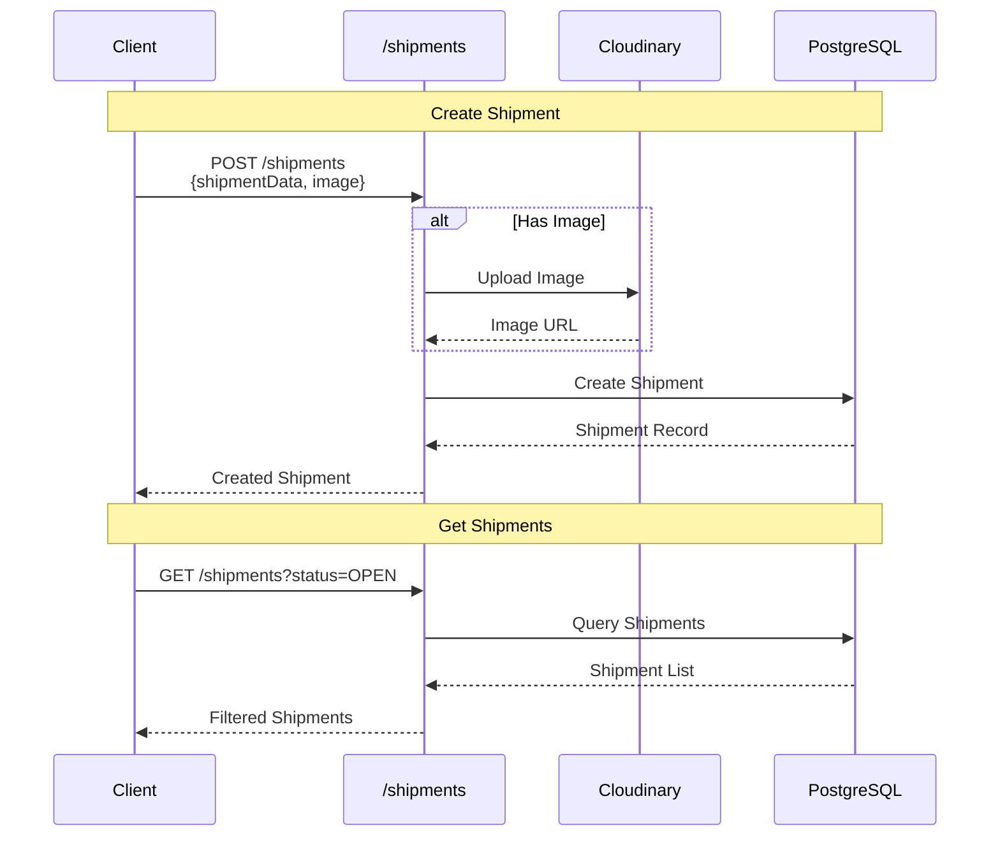
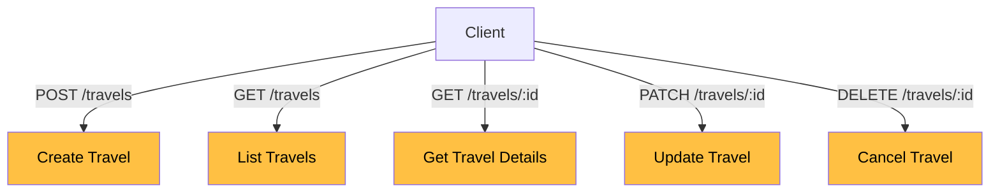
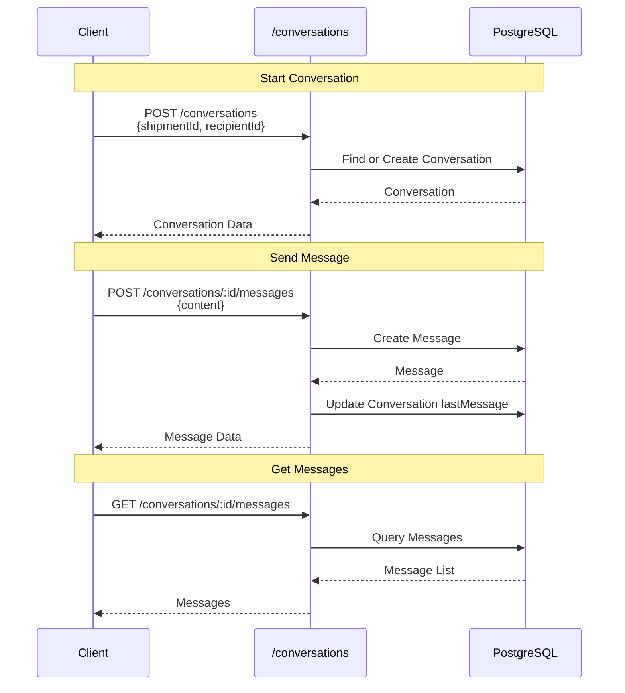
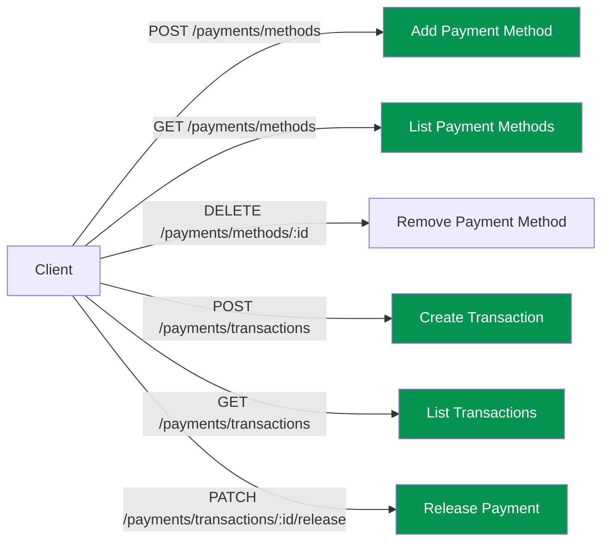
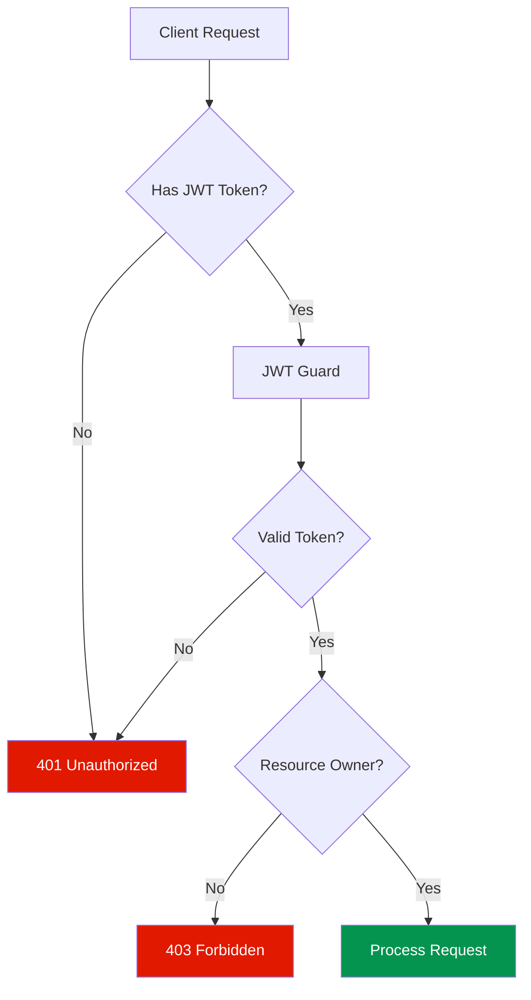
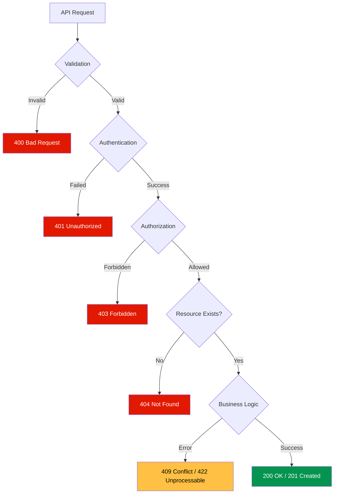
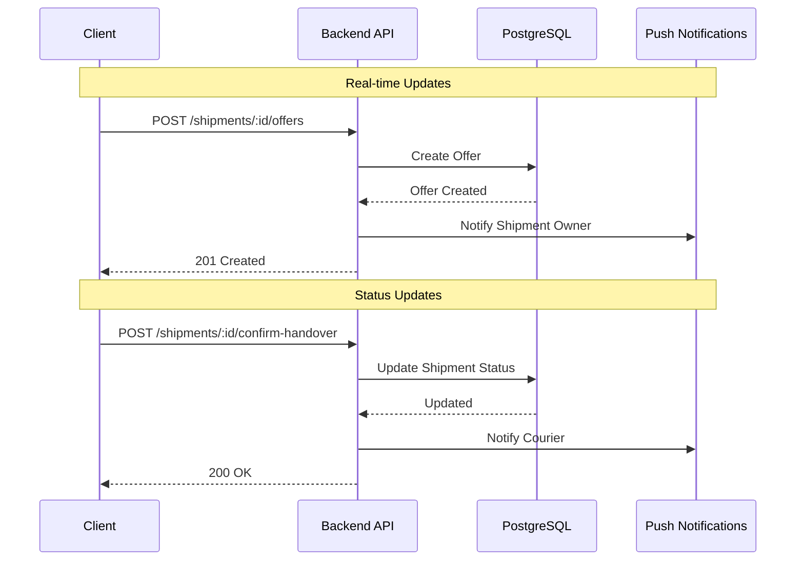

# Raven V2 - API Documentation

## 🔌 Backend API Structure



## 📡 API Endpoints Overview

### Authentication Endpoints



**Endpoints:**
- `POST /auth/signin` - Sign in with Firebase ID token
- `POST /auth/signup` - Create new user account
- `GET /auth/me` - Get current user profile (protected)

### Users Endpoints



**Endpoints:**
- `GET /users/:id` - Get user profile by ID
- `PATCH /users/:id` - Update user profile
- `POST /users/:id/avatar` - Upload profile picture
- `GET /users/:id/stats` - Get user statistics (deliveries, ratings)

### Shipments Endpoints



**Endpoints:**
- `POST /shipments` - Create new shipment (protected)
- `GET /shipments` - Get all shipments (with filters)
- `GET /shipments/:id` - Get shipment details
- `PATCH /shipments/:id` - Update shipment (protected)
- `DELETE /shipments/:id` - Cancel shipment (protected)
- `POST /shipments/:id/offers` - Create offer for shipment (protected)
- `PATCH /shipments/:id/offers/:offerId` - Accept/reject offer (protected)
- `POST /shipments/:id/confirm-handover` - Confirm handover (protected)
- `POST /shipments/:id/confirm-delivery` - Confirm delivery (protected)

**Query Parameters:**
- `status`: Filter by status (OPEN, MATCHED, HANDED_OVER, ON_WAY, DELIVERED)
- `originCountry`: Filter by origin country
- `destCountry`: Filter by destination country
- `minPrice`: Minimum price filter
- `maxPrice`: Maximum price filter
- `dateFrom`: Filter by start date
- `dateTo`: Filter by end date

### Travels Endpoints



**Endpoints:**
- `POST /travels` - Post upcoming travel (protected)
- `GET /travels` - Get all travels (with filters)
- `GET /travels/:id` - Get travel details
- `PATCH /travels/:id` - Update travel (protected)
- `DELETE /travels/:id` - Cancel travel (protected)

**Query Parameters:**
- `fromCountry`: Filter by origin country
- `toCountry`: Filter by destination country
- `dateFrom`: Filter by departure date
- `dateTo`: Filter by arrival date

### Conversations & Messages Endpoints



**Endpoints:**
- `GET /conversations` - Get user's conversations (protected)
- `POST /conversations` - Start new conversation (protected)
- `GET /conversations/:id` - Get conversation details (protected)
- `GET /conversations/:id/messages` - Get conversation messages (protected)
- `POST /conversations/:id/messages` - Send message (protected)
- `PATCH /conversations/:id/messages/:messageId/read` - Mark as read (protected)

### Payments Endpoints



**Endpoints:**
- `POST /payments/methods` - Add payment method (protected)
- `GET /payments/methods` - Get user's payment methods (protected)
- `PATCH /payments/methods/:id` - Update payment method (protected)
- `DELETE /payments/methods/:id` - Remove payment method (protected)
- `POST /payments/transactions` - Create transaction (protected)
- `GET /payments/transactions` - Get user's transactions (protected)
- `GET /payments/transactions/:id` - Get transaction details (protected)
- `PATCH /payments/transactions/:id/release` - Release payment to courier (protected)
- `PATCH /payments/transactions/:id/refund` - Refund payment to sender (protected)

## 🔐 Authentication & Authorization



**Protected Routes:**
All routes except the following require JWT authentication:
- `POST /auth/signin`
- `POST /auth/signup`
- `GET /shipments` (public listing)
- `GET /shipments/:id` (public view)
- `GET /travels` (public listing)
- `GET /travels/:id` (public view)

**Authorization Rules:**
- Users can only update/delete their own resources
- Only shipment sender can accept offers
- Only conversation participants can view/send messages
- Only transaction parties can view transaction details

## 📊 Request/Response Examples

### Create Shipment

**Request:**
```http
POST /shipments
Authorization: Bearer {jwt_token}
Content-Type: multipart/form-data

{
  "originCountry": "Sweden",
  "originCity": "Stockholm",
  "destCountry": "Turkey",
  "destCity": "Istanbul",
  "weight": 5.5,
  "weightUnit": "kg",
  "content": "Electronics",
  "packageType": "Box",
  "dateStart": "2026-02-01T00:00:00Z",
  "dateEnd": "2026-02-15T23:59:59Z",
  "price": 150,
  "currency": "USD",
  "image": <file>
}
```

**Response:**
```json
{
  "id": "clx123abc456",
  "originCountry": "Sweden",
  "originCity": "Stockholm",
  "destCountry": "Turkey",
  "destCity": "Istanbul",
  "weight": 5.5,
  "weightUnit": "kg",
  "content": "Electronics",
  "packageType": "Box",
  "imageUrl": "https://res.cloudinary.com/...",
  "dateStart": "2026-02-01T00:00:00.000Z",
  "dateEnd": "2026-02-15T23:59:59.000Z",
  "price": 150,
  "currency": "USD",
  "status": "OPEN",
  "senderId": "firebase_uid_123",
  "sender": {
    "id": "firebase_uid_123",
    "firstName": "John",
    "lastName": "Doe",
    "avatar": "https://...",
    "isVerified": true
  },
  "createdAt": "2026-01-04T15:45:22.000Z",
  "updatedAt": "2026-01-04T15:45:22.000Z"
}
```

### Get Conversations

**Request:**
```http
GET /conversations
Authorization: Bearer {jwt_token}
```

**Response:**
```json
[
  {
    "id": "conv_123",
    "user1Id": "firebase_uid_123",
    "user2Id": "firebase_uid_456",
    "shipmentId": "clx123abc456",
    "status": "ACTIVE",
    "lastMessage": "When can we meet for handover?",
    "lastMessageAt": "2026-01-04T14:30:00.000Z",
    "user1": {
      "id": "firebase_uid_123",
      "firstName": "John",
      "lastName": "Doe",
      "avatar": "https://..."
    },
    "user2": {
      "id": "firebase_uid_456",
      "firstName": "Jane",
      "lastName": "Smith",
      "avatar": "https://..."
    },
    "shipment": {
      "id": "clx123abc456",
      "originCity": "Stockholm",
      "destCity": "Istanbul",
      "price": 150
    },
    "createdAt": "2026-01-03T10:00:00.000Z",
    "updatedAt": "2026-01-04T14:30:00.000Z"
  }
]
```

## 🚨 Error Handling



**Error Response Format:**
```json
{
  "statusCode": 400,
  "message": "Validation failed",
  "errors": [
    {
      "field": "weight",
      "message": "Weight must be a positive number"
    }
  ]
}
```

## 🔄 Data Synchronization



## 📈 Performance Considerations

1. **Pagination**: Large lists use cursor-based pagination
2. **Caching**: Frequently accessed data cached in memory
3. **Indexing**: Database indexes on frequently queried fields
4. **Image Optimization**: Cloudinary handles image compression
5. **Query Optimization**: Prisma includes only necessary relations

## 🔍 API Versioning

Current version: **v1** (implicit)

Future versions will use URL versioning:
- `/v1/shipments`
- `/v2/shipments`
