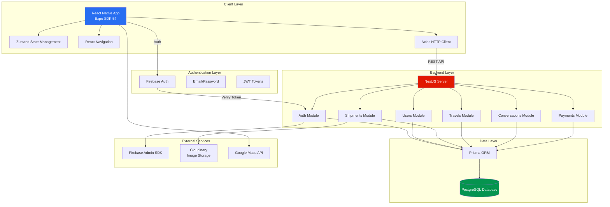
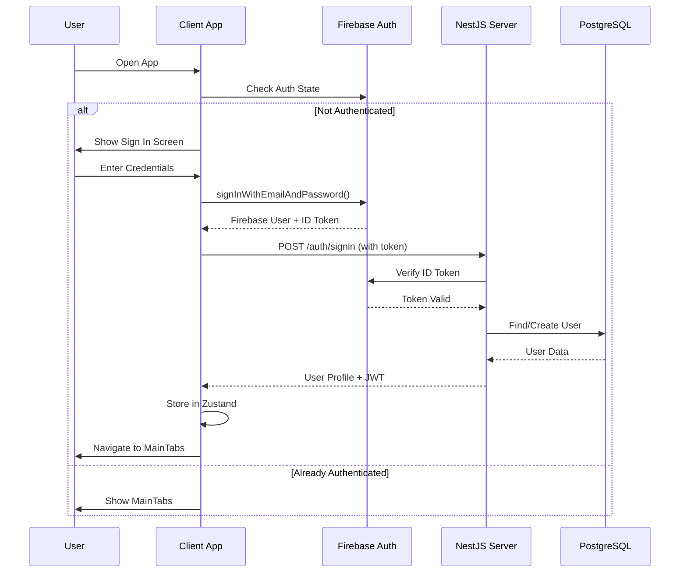
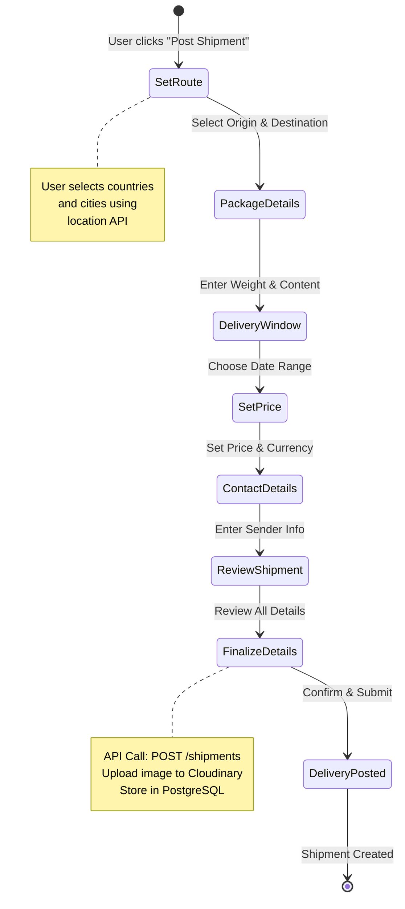
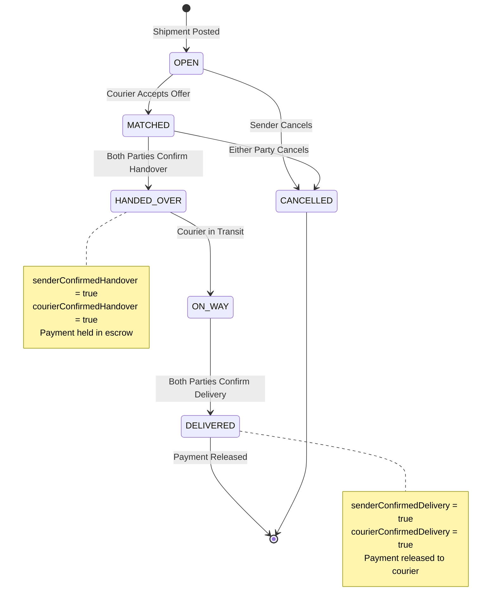
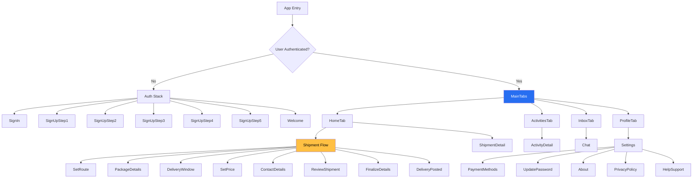
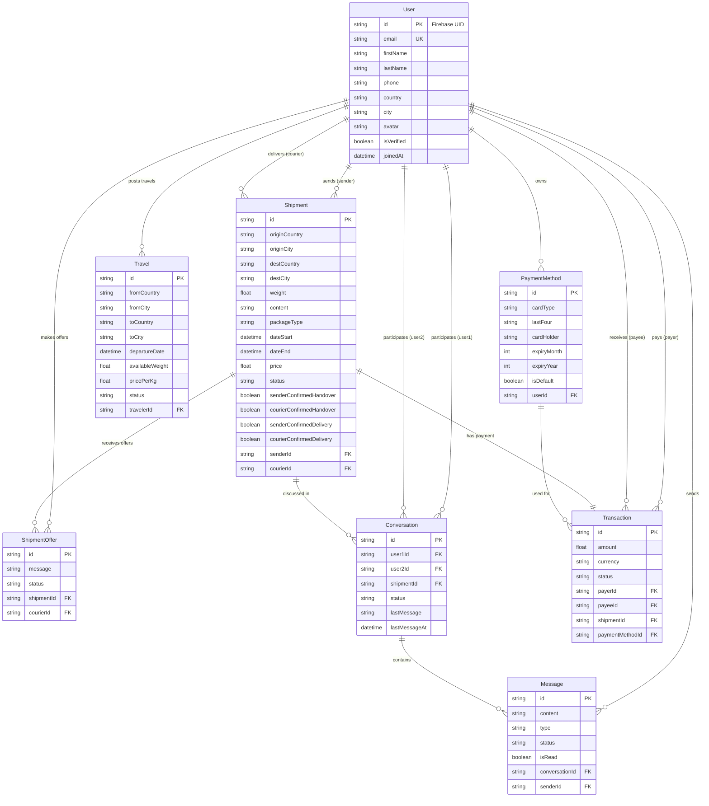
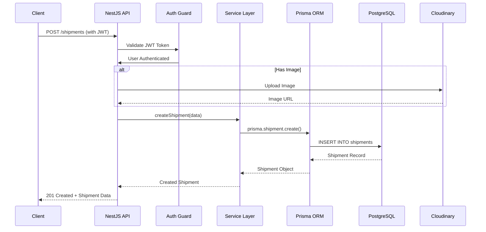

# Raven V2 - System Architecture Documentation

## 🏗️ System Architecture Overview

## 🔄 Application Flow

### Authentication Flow

### Shipment Creation Flow (6-Step Process)

### Shipment Lifecycle

## 📱 Navigation Structure

## 🗄️ Database Schema (ER Diagram)

## 🔌 API Integration Flow

## 🧩 Technology Stack

### Client (Mobile)
- **Framework**: React Native 0.81.5 with Expo SDK 54
- **Language**: TypeScript 5.9.2
- **State Management**: Zustand 5.0.9
- **Navigation**: React Navigation 7.x
- **HTTP Client**: Axios 1.13.2
- **Authentication**: Firebase 12.7.0
- **Maps**: React Native Maps 1.20.1
- **Icons**: Lucide React Native 0.562.0
- **Fonts**: Inter (Google Fonts)

### Server (Backend)
- **Framework**: NestJS 11.0.1
- **Language**: TypeScript 5.7.3
- **Database**: PostgreSQL with Prisma 7.2.0
- **Authentication**: Passport JWT + Firebase Admin 13.6.0
- **Image Storage**: Cloudinary 2.8.0
- **Validation**: class-validator 0.14.3

### Infrastructure
- **Database**: PostgreSQL (Production-ready relational DB)
- **File Storage**: Cloudinary (CDN for images)
- **Authentication**: Firebase Auth (User management)
- **API**: RESTful architecture

## 📊 Data Flow Summary

1. **User Authentication**: Firebase → NestJS verification → PostgreSQL user lookup
2. **Shipment Creation**: Client form → NestJS API → Cloudinary (images) → PostgreSQL
3. **Real-time Chat**: Client → NestJS → PostgreSQL (messages stored)
4. **Payment Processing**: Client → NestJS → PostgreSQL (escrow system)
5. **Location Services**: Client → Google Maps API (direct)

## 🔐 Security Layers

1. **Firebase Authentication** - Email/password with JWT tokens
2. **NestJS Guards** - JWT validation on protected routes
3. **Prisma ORM** - SQL injection prevention
4. **HTTPS** - Encrypted communication (production)
5. **Environment Variables** - Sensitive data protection
