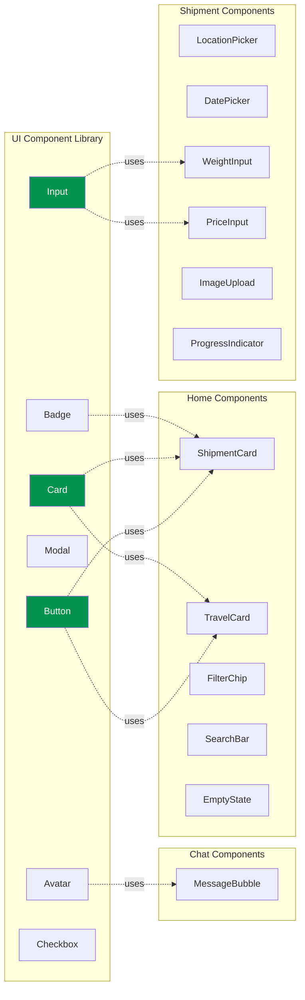
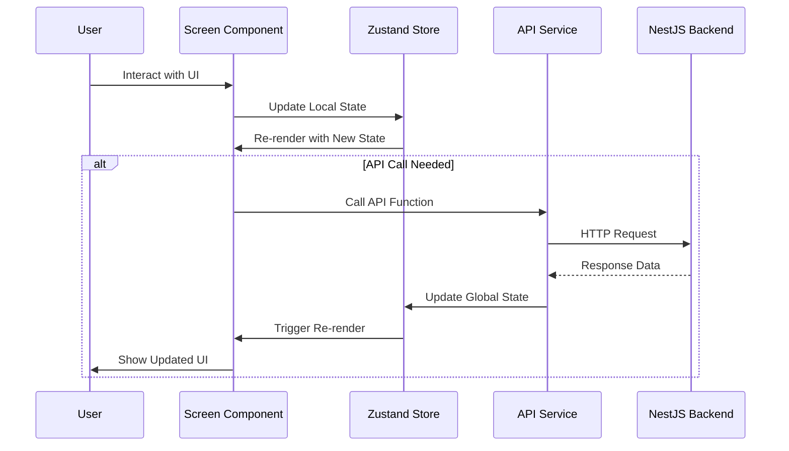
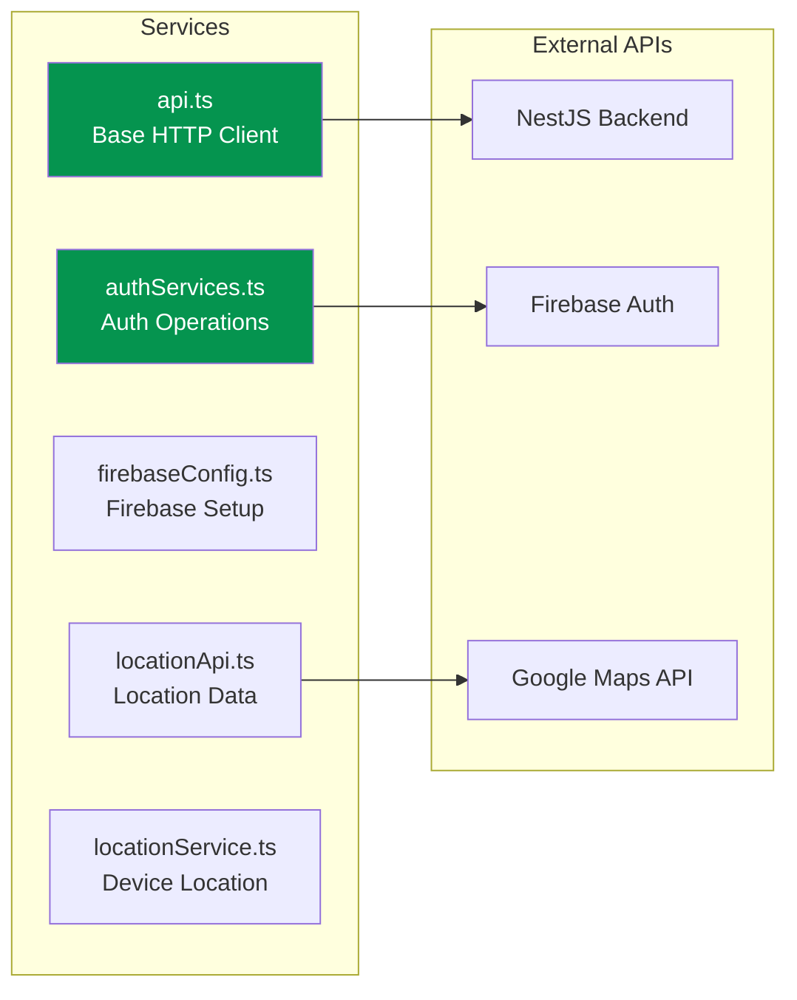

# Raven V2 - Component Tree Documentation

## 📱 React Native Component Hierarchy

```mermaid
graph TD
    A[App.tsx] --> B[Navigation.tsx]
    
    B --> C{Auth State Check}
    
    C -->|Unauthenticated| D[Auth Stack]
    C -->|Authenticated| E[Main Stack]
    
    subgraph "Auth Flow Components"
        D --> D1[WelcomeScreen]
        D --> D2[SignInScreen]
        D --> D3[SignUpStep1Screen<br/>Email & Password]
        D --> D4[SignUpStep2Screen<br/>Personal Info]
        D --> D5[SignUpStep3Screen<br/>Phone Number]
        D --> D6[SignUpStep4Screen<br/>Birthday]
        D --> D7[SignUpStep5Screen<br/>Location]
    end
    
    E --> F[MainTabNavigator]
    
    subgraph "Main Tabs"
        F --> F1[HomeTab]
        F --> F2[ActivitiesTab]
        F --> F3[InboxTab]
        F --> F4[ProfileTab]
    end
    
    subgraph "Home Tab Components"
        F1 --> H1[HomeScreen]
        H1 --> H1A[ShipmentCard]
        H1 --> H1B[TravelCard]
        H1 --> H1C[FilterSection]
        H1 --> H1D[SearchBar]
    end
    
    subgraph "Shipment Flow (6 Steps)"
        E --> S1[SetRouteScreen]
        S1 --> S1A[LocationPicker]
        S1 --> S1B[CountrySelector]
        
        E --> S2[PackageDetailsScreen]
        S2 --> S2A[WeightInput]
        S2 --> S2B[PackageTypeSelector]
        S2 --> S2C[ImageUploadButton]
        
        E --> S3[DeliveryWindowScreen]
        S3 --> S3A[DateRangePicker]
        
        E --> S4[SetPriceScreen]
        S4 --> S4A[PriceInput]
        S4 --> S4B[CurrencySelector]
        
        E --> S5[ContactDetailsScreen]
        S5 --> S5A[PhoneInput]
        S5 --> S5B[FullNameInput]
        
        E --> S6[ReviewShipmentScreen]
        S6 --> S6A[ReviewCard]
        S6 --> S6B[EditButton]
        
        E --> S7[FinalizeDetailsScreen]
        S7 --> S7A[TermsCheckbox]
        
        E --> S8[DeliveryPostedScreen]
        S8 --> S8A[SuccessAnimation]
    end
    
    subgraph "Activities Components"
        F2 --> A1[ActivitiesScreen]
        A1 --> A1A[ActivityCard]
        A1 --> A1B[StatusBadge]
        A1 --> A1C[FilterTabs]
        
        E --> A2[ActivityDetailScreen]
        A2 --> A2A[ShipmentInfo]
        A2 --> A2B[StatusTimeline]
        A2 --> A2C[ActionButtons]
        A2 --> A2D[ConfirmationModal]
    end
    
    subgraph "Inbox/Chat Components"
        F3 --> I1[InboxScreen]
        I1 --> I1A[ConversationCard]
        I1 --> I1B[UnreadBadge]
        
        E --> I2[ChatScreen]
        I2 --> I2A[MessageBubble]
        I2 --> I2B[MessageInput]
        I2 --> I2C[ChatHeader]
    end
    
    subgraph "Profile Components"
        F4 --> P1[ProfileScreen]
        P1 --> P1A[ProfileHeader]
        P1 --> P1B[StatsCard]
        P1 --> P1C[SettingsMenu]
        P1 --> P1D[AvatarUpload]
        
        E --> P2[PublicProfileScreen]
        E --> P3[UpdatePasswordScreen]
        E --> P4[EarningsScreen]
        P4 --> P4A[EarningsChart]
        P4 --> P4B[TransactionList]
    end
    
    subgraph "Payment Components"
        E --> PM1[PaymentMethodsScreen]
        PM1 --> PM1A[PaymentCard]
        PM1 --> PM1B[AddCardButton]
        
        E --> PM2[AddCardScreen]
        PM2 --> PM2A[CardForm]
        PM2 --> PM2B[CardPreview]
    end
    
    subgraph "Settings Components"
        E --> SET1[AboutScreen]
        E --> SET2[PrivacyPolicyScreen]
        E --> SET3[HelpSupportScreen]
        E --> SET4[NetworkDiagnosticsScreen]
    end
    
    subgraph "Delivery Components"
        E --> DEL1[DeliveryTrackingScreen]
        DEL1 --> DEL1A[MapView]
        DEL1 --> DEL1B[TrackingTimeline]
    end
    
    subgraph "Shipment Detail"
        E --> SD1[ShipmentDetailScreen]
        SD1 --> SD1A[ShipmentHeader]
        SD1 --> SD1B[RouteMap]
        SD1 --> SD1C[OffersList]
        SD1 --> SD1D[OfferCard]
        SD1 --> SD1E[AcceptOfferButton]
    end
    
    style A fill:#000,color:#fff
    style F fill:#276EF1,color:#fff
    style D fill:#E11900,color:#fff
```



## 🧩 Reusable UI Components



## 📂 Component File Structure

```
client/src/
├── components/
│   ├── ui/                      # Reusable UI Components
│   │   ├── Button.tsx
│   │   ├── Input.tsx
│   │   ├── Card.tsx
│   │   ├── Modal.tsx
│   │   ├── Badge.tsx
│   │   ├── Avatar.tsx
│   │   └── Checkbox.tsx
│   ├── home/                    # Home-specific Components
│   │   ├── ShipmentCard.tsx
│   │   ├── TravelCard.tsx
│   │   ├── FilterChip.tsx
│   │   ├── SearchBar.tsx
│   │   └── EmptyState.tsx
│   ├── shipment/                # Shipment Flow Components
│   │   ├── LocationPicker.tsx
│   │   ├── DatePicker.tsx
│   │   ├── WeightInput.tsx
│   │   ├── PriceInput.tsx
│   │   ├── ImageUpload.tsx
│   │   └── ProgressIndicator.tsx
│   └── chat/                    # Chat Components
│       └── MessageBubble.tsx
│
├── screens/
│   ├── auth/                    # Authentication Screens
│   │   ├── SignInScreen.tsx
│   │   ├── SignUpStep1Screen.tsx
│   │   ├── SignUpStep2Screen.tsx
│   │   ├── SignUpStep3Screen.tsx
│   │   ├── SignUpStep4Screen.tsx
│   │   └── SignUpStep5Screen.tsx
│   ├── shipment/                # Shipment Flow Screens
│   │   ├── SetRouteScreen.tsx
│   │   ├── PackageDetailsScreen.tsx
│   │   ├── DeliveryWindowScreen.tsx
│   │   ├── SetPriceScreen.tsx
│   │   ├── ContactDetailsScreen.tsx
│   │   ├── ReviewShipmentScreen.tsx
│   │   ├── FinalizeDetailsScreen.tsx
│   │   ├── DeliveryPostedScreen.tsx
│   │   └── ShipmentDetailScreen.tsx
│   ├── tabs/                    # Main Tab Screens
│   │   ├── HomeTab.tsx
│   │   ├── ActivitiesTab.tsx
│   │   ├── InboxTab.tsx
│   │   └── ProfileTab.tsx
│   ├── chat/
│   │   └── ChatScreen.tsx
│   ├── inbox/
│   │   └── InboxScreen.tsx
│   ├── delivery/
│   │   └── DeliveryTrackingScreen.tsx
│   ├── payments/
│   │   ├── PaymentMethodsScreen.tsx
│   │   └── AddCardScreen.tsx
│   ├── settings/
│   │   ├── AboutScreen.tsx
│   │   ├── PrivacyPolicyScreen.tsx
│   │   └── HelpSupportScreen.tsx
│   ├── WelcomeScreen.tsx
│   ├── ProfileScreen.tsx
│   ├── PublicProfileScreen.tsx
│   ├── UpdatePasswordScreen.tsx
│   ├── EarningsScreen.tsx
│   ├── ActivitiesScreen.tsx
│   ├── ActivityDetailScreen.tsx
│   └── NetworkDiagnosticsScreen.tsx
│
├── navigation/
│   └── MainTabNavigator.tsx
│
├── store/                       # Zustand State Management
│   ├── useAuthStore.ts
│   ├── useShipmentStore.ts
│   └── useSignupStore.ts
│
├── services/                    # API & External Services
│   ├── api.ts
│   ├── authServices.ts
│   ├── firebaseConfig.ts
│   ├── locationApi.ts
│   └── locationService.ts
│
├── theme/                       # Design System
│   └── index.ts
│
└── utils/
    └── (utility functions)
```

## 🔄 Component Data Flow



## 🎨 Component Styling Pattern

All components follow the design system defined in `theme/index.ts`:

```typescript
// Example Component Structure
import { colors, typography, spacing } from '../theme';

const styles = StyleSheet.create({
  container: {
    backgroundColor: colors.background,
    padding: spacing.md,
  },
  title: {
    fontFamily: typography.fontFamily.bold,
    fontSize: typography.fontSize.xl,
    color: colors.textPrimary,
  },
});
```

## 📊 State Management Architecture

```mermaid
graph TD
    subgraph "Zustand Stores"
        A1[useAuthStore]
        A2[useShipmentStore]
        A3[useSignupStore]
    end
    
    subgraph "Auth Store State"
        B1[user: User | null]
        B2[loading: boolean]
        B3[setUser]
        B4[setLoading]
        B5[logout]
    end
    
    subgraph "Shipment Store State"
        C1[shipmentData]
        C2[currentStep]
        C3[updateShipmentData]
        C4[resetShipment]
    end
    
    subgraph "Signup Store State"
        D1[signupData]
        D2[updateSignupData]
        D3[resetSignup]
    end
    
    A1 --> B1
    A1 --> B2
    A1 --> B3
    A1 --> B4
    A1 --> B5
    
    A2 --> C1
    A2 --> C2
    A2 --> C3
    A2 --> C4
    
    A3 --> D1
    A3 --> D2
    A3 --> D3
    
    style A1 fill:#276EF1,color:#fff
    style A2 fill:#276EF1,color:#fff
    style A3 fill:#276EF1,color:#fff
```

## 🔌 Service Layer Architecture



## 📱 Screen Component Breakdown

### HomeTab Components
- **ShipmentCard**: Displays shipment summary with route, price, and status
- **TravelCard**: Shows travel listings with available capacity
- **FilterSection**: Allows filtering by route, date, price
- **SearchBar**: Quick search for shipments/travels

### Shipment Flow Components
- **LocationPicker**: Autocomplete location search with country/city selection
- **DateRangePicker**: Calendar-based date range selection
- **WeightInput**: Numeric input with unit selector (kg/lbs)
- **PriceInput**: Currency input with currency selector
- **ImageUpload**: Camera/gallery picker with preview
- **ProgressIndicator**: 6-step progress dots

### Activities Components
- **ActivityCard**: Compact shipment card with status badge
- **StatusTimeline**: Visual timeline of shipment progress
- **ConfirmationModal**: Handover/delivery confirmation dialog

### Chat Components
- **MessageBubble**: Styled message with sender/receiver variants
- **MessageInput**: Text input with send button
- **ChatHeader**: Shows recipient info and shipment details

### Profile Components
- **ProfileHeader**: Avatar, name, verification badge
- **StatsCard**: Displays completed deliveries, rating, earnings
- **SettingsMenu**: List of settings options
- **AvatarUpload**: Image picker for profile photo

## 🎯 Key Component Patterns

1. **Screen Components**: Full-page views with navigation
2. **Container Components**: Manage state and data fetching
3. **Presentational Components**: Pure UI components
4. **Reusable UI Components**: Design system primitives
5. **Service Components**: API and external service integrations
