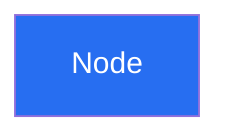

# 📊 How to Use These Diagrams

## Overview

I've created comprehensive visual documentation for the Raven V2 project using **Mermaid** syntax. These diagrams can be viewed and edited in multiple ways.

## 📁 Generated Documentation Files

1. **ARCHITECTURE.md** - System architecture, flows, database schema
2. **COMPONENT_TREE.md** - React Native component hierarchy
3. **API.md** - Backend API structure and endpoints

## 🛠️ Viewing Options

### Option 1: VS Code (Recommended for Quick Preview)

1. **Install Mermaid Extension:**
   - Open VS Code
   - Go to Extensions (Ctrl+Shift+X)
   - Search for "Markdown Preview Mermaid Support"
   - Install it

2. **View Diagrams:**
   - Open any `.md` file in `docs/`
   - Press `Ctrl+Shift+V` (or `Cmd+Shift+V` on Mac)
   - Diagrams will render automatically

### Option 2: Eraser.io (Best for Editing & Collaboration)

**Eraser.io** is perfect for your needs! Here's how to use it:

1. **Go to [eraser.io](https://www.eraser.io)**
2. **Create a free account**
3. **Import Mermaid diagrams:**
   - Click "New Document"
   - Click the "Code" button or press `/`
   - Select "Mermaid"
   - Copy-paste any Mermaid code block from the docs
   - Eraser will render it beautifully

**Benefits of Eraser.io:**
- ✅ Real-time collaboration
- ✅ Beautiful rendering
- ✅ Export to PNG, SVG, PDF
- ✅ Share links with team
- ✅ Edit diagrams visually or via code
- ✅ Version history

**Example workflow:**
```
1. Open ARCHITECTURE.md
2. Copy the System Architecture diagram (lines 7-60)
3. Paste into Eraser.io
4. Customize colors, layout, labels
5. Export as PNG for presentations
```

### Option 3: Mermaid Live Editor (Quick Online Tool)

1. **Go to [mermaid.live](https://mermaid.live)**
2. **Paste any Mermaid code**
3. **See instant preview**
4. **Export as PNG/SVG**

### Option 4: GitHub/GitLab (Automatic Rendering)

If you push this to GitHub or GitLab:
- Mermaid diagrams render automatically in markdown files
- No setup needed
- Great for documentation

### Option 5: Excalidraw (Hand-drawn Style)

**Excalidraw** is great for more casual, sketch-style diagrams:

1. **Go to [excalidraw.com](https://excalidraw.com)**
2. **Manually recreate diagrams** (no direct Mermaid import)
3. **Export as PNG/SVG**
4. **Great for presentations** with a hand-drawn aesthetic

## 🎨 Customizing Diagrams

### In Mermaid (Code-based)

You can customize colors, styles, and layout directly in the code:



### In Eraser.io (Visual)

- Click any node to change colors
- Drag to rearrange layout
- Add notes and annotations
- Change arrow styles

## 📸 What Screenshots/Data I Need

To enhance these diagrams, you could provide:

### 1. **Actual Screenshots** (Optional but helpful)
- Home screen with shipment cards
- Shipment creation flow (all 6 steps)
- Chat interface
- Profile screen
- Activities screen

**How to provide:** Just take screenshots and I can:
- Add them to the documentation
- Create annotated versions
- Build a visual user flow guide

### 2. **Real Data Examples** (Optional)
- Sample shipment data (anonymized)
- Typical user journey scenarios
- Common use cases

### 3. **Branding Assets** (If available)
- Logo files
- Brand colors (I already have from theme)
- Marketing materials

## 🚀 Next Steps

### Immediate Actions:

1. **View in VS Code:**
   ```bash
   # Install Mermaid extension
   code --install-extension bierner.markdown-mermaid
   ```

2. **Try Eraser.io:**
   - Go to eraser.io
   - Create account
   - Import the System Architecture diagram
   - Customize and export

3. **Share with Team:**
   - Export diagrams as PNG/PDF
   - Add to presentations
   - Include in project wiki

### For Presentations:

I recommend creating a **visual deck** with:
1. System Architecture (from ARCHITECTURE.md)
2. User Flow (Authentication → Shipment → Delivery)
3. Database Schema (ER Diagram)
4. Component Tree (high-level overview)
5. Screenshots of actual app

## 📋 Diagram Index

### ARCHITECTURE.md Contains:
- ✅ System Architecture Overview
- ✅ Authentication Flow
- ✅ Shipment Creation Flow (6 steps)
- ✅ Shipment Lifecycle State Machine
- ✅ Navigation Structure
- ✅ Database ER Diagram
- ✅ API Integration Flow
- ✅ Technology Stack Summary

### COMPONENT_TREE.md Contains:
- ✅ Complete Component Hierarchy
- ✅ Reusable UI Components
- ✅ File Structure
- ✅ Component Data Flow
- ✅ State Management Architecture
- ✅ Service Layer Architecture

### API.md Contains:
- ✅ Backend Module Structure
- ✅ All API Endpoints
- ✅ Authentication Flow
- ✅ Request/Response Examples
- ✅ Error Handling Flow
- ✅ Data Synchronization

## 🎯 Recommended Workflow for Your Use Case

Based on your request, here's what I suggest:

### For System Documentation:
1. **Use Eraser.io** for the main architecture diagram
2. **Export as PNG** for presentations
3. **Keep Mermaid source** in docs for version control

### For Team Collaboration:
1. **Push to GitHub** - diagrams auto-render
2. **Share Eraser.io links** for live collaboration
3. **Export PDFs** for stakeholders

### For Presentations:
1. **Combine diagrams with screenshots**
2. **Use Figma or PowerPoint** to create slides
3. **Add annotations** to highlight key features

## 💡 Pro Tips

1. **Mermaid is version-controllable** - Keep diagrams in code
2. **Eraser.io is collaborative** - Great for team brainstorming
3. **Screenshots + Diagrams** = Powerful documentation
4. **Update diagrams** as the system evolves
5. **Export multiple formats** (PNG for docs, SVG for web)

## 🆘 Need Help?

If you need:
- Different diagram styles
- Additional diagrams (deployment, infrastructure, etc.)
- Screenshots annotated
- Custom visualizations
- Figma/Sketch versions

Just let me know! I can generate more diagrams or help you customize these.

## 📚 Additional Resources

- [Mermaid Documentation](https://mermaid.js.org/)
- [Eraser.io Tutorials](https://docs.eraser.io/)
- [Excalidraw Guide](https://excalidraw.com/)
- [GitHub Mermaid Support](https://github.blog/2022-02-14-include-diagrams-markdown-files-mermaid/)
